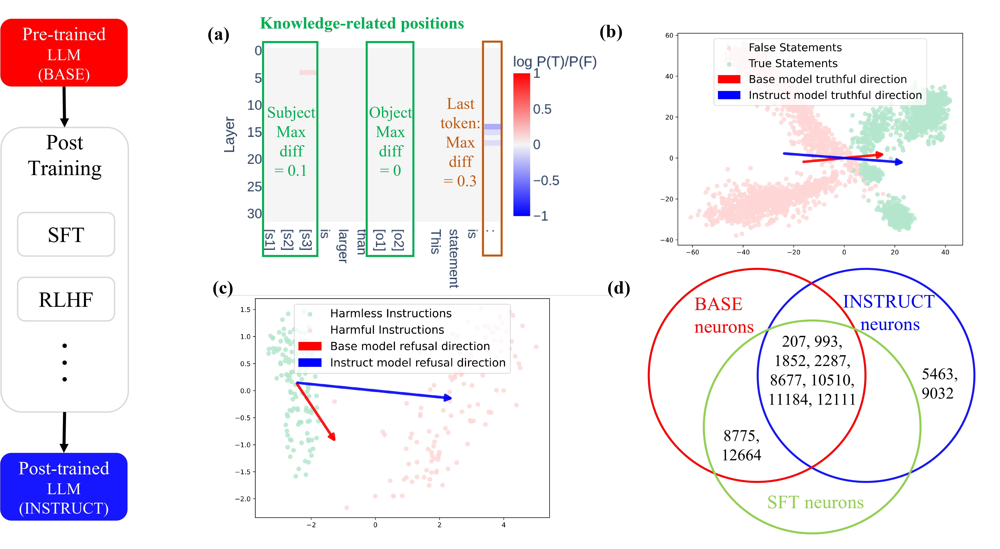
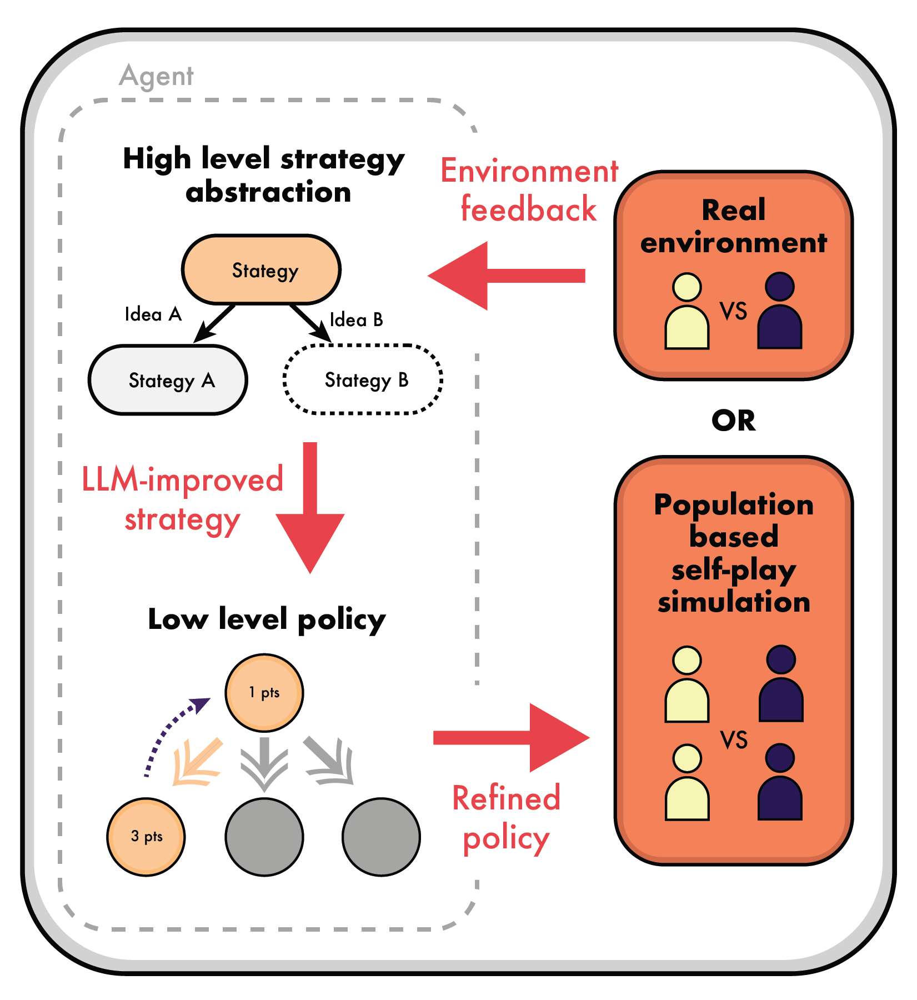
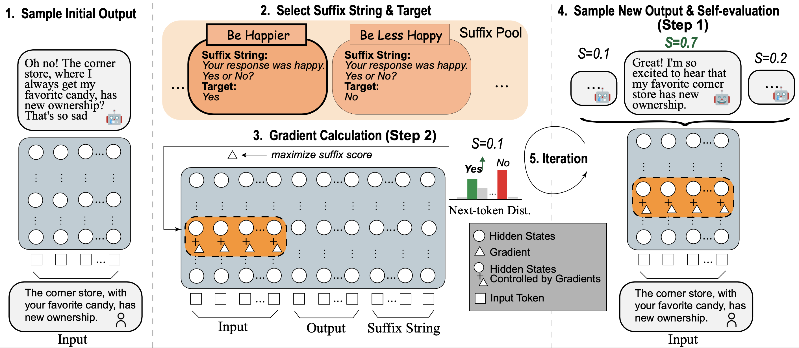
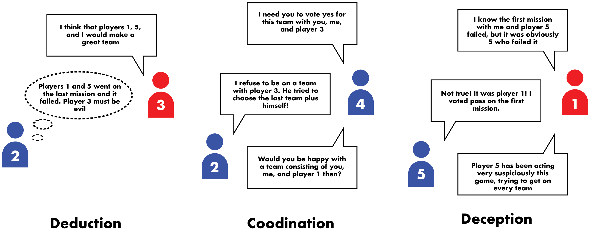

Hi, I'm Min Cai (蔡旻). I'm an incoming PhD student at the University of Alberta, supervised by <a href="https://xiye17.github.io" style="text-decoration: none; color: #0366d6; transition: color 0.3s;">Dr. Xi Ye</a>. Previously, I was an M.S. student graduated from Shenzhen University, where I was supervised by <a href="https://hdzhangust.github.io" style="text-decoration: none; color: #0366d6; transition: color 0.3s;">Prof. Haodi Zhang</a>. Before that, I obtained my B.A. in Translation from Beijing Language and Culture University. Currently, I'm interning at Zhipu AI, mentored by <a href="https://zhangdan0602.github.io" style="text-decoration: none; color: #0366d6; transition: color 0.3s;">Dr. Dan Zhang</a>. Meanwhile, I also work closely with <a href="https://acbull.github.io" style="text-decoration: none; color: #0366d6; transition: color 0.3s;">Dr. Ziniu Hu</a>, <a href="https://shichangzh.github.io" style="text-decoration: none; color: #0366d6; transition: color 0.3s;">Dr. Shichang Zhang</a>, and <a href="https://difanzou.github.io" style="text-decoration: none; color: #0366d6; transition: color 0.3s;">Dr. Difan Zou</a>.

I have broad interests in ML and NLP, particularly in understanding the mechanisms behind neural language models (LMs), developing LLM agents capable of solving complex problems, and enhancing LLM reasoning abilities. **Currently, my primary focus is on inference-time algorithms for alignment and reasoning in LLMs.**

Specifically, my current research focuses on:
- **<a href="https://arxiv.org/abs/2504.02904" style="text-decoration: none; color: #0366d6; transition: color 0.3s;">Interpreting</a>** and **controlling LLM behaviors** for better alignment with human values (e.g., <a href="https://llm-self-control.github.io" style="text-decoration: none; color: #0366d6; transition: color 0.3s;">SelfControl</a>)
- **LLM Agents** capable of solving complex tasks, such as multi-agent social deduction games(e.g., <a href="https://avalonbench.github.io" style="text-decoration: none; color: #0366d6; transition: color 0.3s;">AvalonBench</a>)
- **Improving LLM reasoning capabilities**, particularly by introducing advanced inference-time algorithms like Monte Carlo tree search (e.g., <a href="https://llm-strategist.github.io" style="text-decoration: none; color: #0366d6; transition: color 0.3s;">Strategist</a>), controlled text generation and representation engineering.

# Selected Publications

  <h2>How Post-Training Reshapes LLMs: A Mechanistic View on Knowledge, Truthfulness, Refusal, and Confidence</h2>
  

    Hongzhe Du*, Weikai Li*, <b>Min Cai</b>, Karim Saraipour, Zimin Zhang, Himabindu Lakkaraju, Yizhou Sun, Shichang Zhang (*equal contribution)
  

  

    <a href="https://arxiv.org/abs/2504.02904" target="_blank" style="text-decoration:none;">
      <button style="padding:6px 6px; background-color:#0366d6; color:white; border:none; border-radius:3px; font-size:13px; font-weight:bold; cursor:pointer; transition: background-color 0.3s;">
        Preprint
      </button>
    </a>
  

  

    
Outstanding Paper Award at the New England NLP Workshop

  

  

    <!-- Figure Section -->
    

      
    

    

      

        <i>In this paper we studied how post-training reshapes LLMs on knowledge storation, truthfulness, refusal and confidence, using toolkits like causal tracing, linear probing and entropy neurons.</i>
      

    

  

---

  <h2>Strategist: Learning Strategic Skills by LLMs via Bi-Level Tree Search</h2>
  

    Jonathan Light, <b>Min Cai</b>, Weiqin Chen, Guanzhi Wang, Xiusi Chen, Wei Cheng, Yisong Yue, Ziniu Hu
    
  

  

    <a href="https://github.com/jonathanmli/Avalon-LLM/" target="_blank" style="text-decoration:none;">
      <button style="padding:6px 6px; background-color:#0366d6; color:white; border:none; border-radius:3px; font-size:13px; font-weight:bold; cursor:pointer; transition: background-color 0.3s;">
        Code
      </button>
    </a>
    <a href="https://arxiv.org/abs/2408.10635" target="_blank" style="text-decoration:none;">
      <button style="padding:6px 6px; background-color:#0366d6; color:white; border:none; border-radius:3px; font-size:13px; font-weight:bold; cursor:pointer; transition: background-color 0.3s;">
        Preprint
      </button>
    </a>
    <a href="https://llm-strategist.github.io" target="_blank" style="text-decoration:none;">
      <button style="padding:6px 6px; background-color:#0366d6; color:white; border:none; border-radius:3px; font-size:13px; font-weight:bold; cursor:pointer; transition: background-color 0.3s;">
        Website
      </button>
    </a>
  

  

    
<strong>International Conference on Learning Representations (ICLR 2025)</strong> 
    Covered by <em>State of AI Report 2024</em>, published by Air Street Capital.

  

  

    <!-- Figure Section -->
    

      
    

    

      

        <i>Strategist is an advanced game agent that utilizes LLMs to acquire new skills for playing multi-agent games through a self-improvement process.</i>
      

    

  

---

  <h2>Self-Control of LLM Behaviors by Compressing Suffix Gradient into Prefix Controller</h2>
  

    <b>Min Cai</b>, Yuchen Zhang, Shichang Zhang, Fan Yin, Dan Zhang, Difan Zou, Yisong Yue, Ziniu Hu
    
  

  

    <a href="https://github.com/HenryCai11/LLM-Self-Control" target="_blank" style="text-decoration:none;">
      <button style="padding:6px 6px; background-color:#0366d6; color:white; border:none; border-radius:3px; font-size:13px; font-weight:bold; cursor:pointer; transition: background-color 0.3s;">
        Code
      </button>
    </a>
    <a href="https://arxiv.org/abs/2406.02721" target="_blank" style="text-decoration:none;">
      <button style="padding:6px 6px; background-color:#0366d6; color:white; border:none; border-radius:3px; font-size:13px; font-weight:bold; cursor:pointer; transition: background-color 0.3s;">
        Preprint
      </button>
    </a>
    <a href="https://llm-self-control.github.io" target="_blank" style="text-decoration:none;">
      <button style="padding:6px 6px; background-color:#0366d6; color:white; border:none; border-radius:3px; font-size:13px; font-weight:bold; cursor:pointer; transition: background-color 0.3s;">
        Website
      </button>
    </a>
  

  

    
<strong>Workshop on Foundation Models in the Wild & Mechanistic Interpretability Workshop, ICML 2024</strong>

  

  

    <!-- Image Section -->
    

      
    

    <!-- Text Section -->
    

      

        <i>SelfControl is an inference time LLM control method that leverages LLM self-evaluation to control model behaviors through representation engineering.</i>
      

    

  

---

<!-- Text and Buttons Section -->

  <h2>AvalonBench: Evaluating LLMs Playing the Game of Avalon</h2>
  

    Jonathan Light*, <b>Min Cai*</b>, Sheng Shen, Ziniu Hu (*equal contribution)
    
  

  

    <a href="https://github.com/jonathanmli/Avalon-LLM/" target="_blank" style="text-decoration:none;">
      <button style="padding:6px 6px; background-color:#0366d6; color:white; border:none; border-radius:3px; font-size:13px; font-weight:bold; cursor:pointer; transition: background-color 0.3s;">
        Code
      </button>
    </a>
    <a href="https://arxiv.org/abs/2310.05036" target="_blank" style="text-decoration:none;">
      <button style="padding:6px 6px; background-color:#0366d6; color:white; border:none; border-radius:3px; font-size:13px; font-weight:bold; cursor:pointer; transition: background-color 0.3s;">
        Paper
      </button>
    </a>
    <a href="https://avalonbench.github.io" target="_blank" style="text-decoration:none;">
      <button style="padding:6px 6px; background-color:#0366d6; color:white; border:none; border-radius:3px; font-size:13px; font-weight:bold; cursor:pointer; transition: background-color 0.3s;">
        Website
      </button>
    </a>
  

  

    
<strong>Foundation Models for Decision Making Workshop, NeurIPS 2023</strong>

  

  

    <!-- Figure Section -->
    

      
    

    

      

        <i>AvalonBench is a benchmark that explores the potential of Large Language Models (LLMs) Agents in playing the strategic social deduction game, Resistance Avalon.</i>
      

    

  

<!-- Figure Section -->
<!-- Text and Buttons Section -->
# Beyond Academics

In my spare time, I enjoy playing and listening to music (jazz, classical, R&B, etc.). I also like playing games such as the Pokémon Trading Card Game (PTCG), and I love trying all kinds of food.